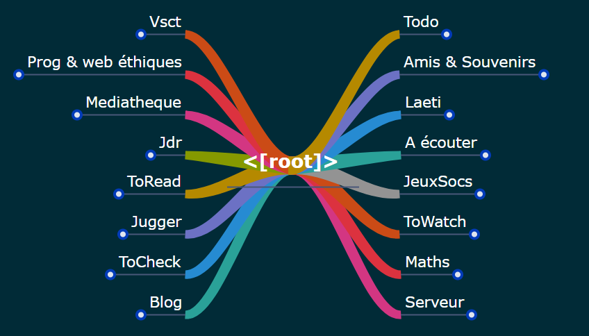

Simple web mindmap renderer.

Fork of https://bitbucket.org/wisemapping/wisemapping-open-source, inspired by https://framagit.org/framasoft/framindmap

# Demo

https://chezsoi.org/lucas/mindmap/mindmap-viewer

# Usage

Once the JS bundle is generated, any static files web server will do the job.
E.g. with Python:

    make
    python3 -m http.server  # then open http://localhost:8000/?optional_mindmap_name

Where `optional_mindmap_name.xml` must be in `samples`.

You can create those XML files from simple indented Markdown files with this Python script: https://github.com/Lucas-C/brain_dump

## Theme style : fonts, colors, etc.

To define a global style, you can define the following style objects in Javascript, by taking inspiration from `mindplot/TopicStyle.js`:

- `CENTRAL_TOPIC_STYLE`
- `MAIN_TOPIC_STYLE`
- `SUB_TOPIC_STYLE`
- `ISOLATED_TOPIC_STYLE`

You can also define the following constants whose default values are in `mindplot/Topic.js`:

- `CONNECTOR_WIDTH`
- `OUTER_SHAPE_ATTRIBUTES`
- `OUTER_SHAPE_ATTRIBUTES_FOCUS`
- `INNER_RECT_ATTRIBUTES`

To define a different style per mindmap, you can use the following XML attributes:

- `bgColor`
- `brColor`
- `fontStyle` : `<font_size>;<font_family>;<font_color>;bold;italic`

# Developpement

The global project architecture is discribed here: https://wisemapping.atlassian.net/wiki/display/WS/Architecture
The JS files loading order matters and is managed by the `Makefile`.

Using [livereload](https://github.com/lepture/python-livereload) (do not forget to define the `$BROWSER` env variable, or else `lynx` may fire up):

    pip install --user https://github.com/Lucas-C/python-livereload/archive/master.zip
    livereload --open-url-delay 1 --target mindmap-viewer-bundle.js . & watch -n 1 make

## XSD schema

The `mindmap-schema.svg` is an interactive SVG visualisation of the eponymous XSD schema alongside, and was generated with `xsdvi`.

<!--
TODO:
- visually:
  * provide control on how "packed" is the mindmap
  * viewport mess: mindmap peu dépasser au démarrage + resizing small->big pas supporté
  * keystrokes are captured (ex: CTRL+ALT+I, CTRL+H) : why ???
  * add srcCtrlPoint/destCtrlPoint to relationships
- publish Python code on pypi
- try another syntax parser than pyparsing
- `Synchronous XMLHttpRequest` warning comes from the way XML mindmaps are loaded in LocalStorageManager.js
- restore unit tests from repo history
-->
